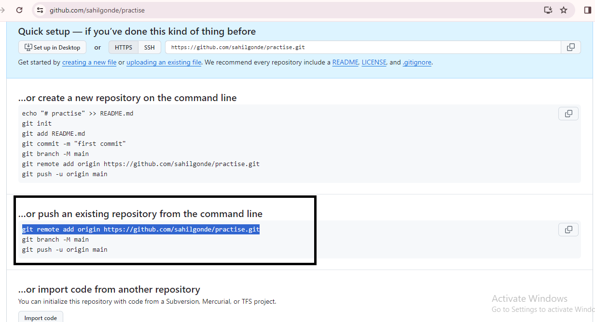

## Git Commands

1. ### git init

The `git init` command is used to **initialize a new Git repository** in your project folder. This command is used once during the initial setup of a new repository.

2. ### git status

The `git status` command **displays the status** of your working project. It shows which files have been modified or staged and which files are untracked.

3.  ### git add

The `git add <filename>` command **adds new or changed files** in your working project to the Git staging area. You can add specific files by providing their filenames, or you can use `git add .` to add all changed files.

4. ### git commit

The `git commit` command is used to **record the changes** in the repository. Each commit includes a commit message that describes the changes made in that commit.

**Syntax :**

```html
git commit -m "commit message"
```

5. ### git push

The `git push` command is used to **upload local branch commits** to GitHub. It pushes your local changes to the remote repository on GitHub.

To push your code to GitHub using Git commands, follow these steps:

## Pushing Existing Code to a Git Repository

1. ### Initialize a Git repository:

If you haven't already done so, navigate to the root directory of your project using a command-line interface, and run the following command to initialize a Git repository:

```html
git init
```

2. ### Check git status :

   This command is used to check the status of git repository  like if any nodification done then it will track it.

```html
git status
```

3. ### Add a changes in file 
   By using given commands you can add changes in github repository , changes can be add by two methods :
   1. `git add .` :- When more than one file is changed , this command is used.
   2. `git add <file name>` :- When only one file change , this command is used.

```html
git add .
```

```html
git add <file name>
```

4. ### Commit changes 
   After changing or modifying any file we have to add code , after modifying code we have to add commit for showing what changes in repository

```html
git commit -m "add a message "
```

5. ### Push the changes:
   By using this command code can be push in github repository after creating repository

```html
git push
```
After this error will come it will then we have to add github repositary where we have to add the code

6. ### Create a repositary :
   Create repository  if dont know how to create repository then [click here](http://localhost:3000/docs/github/how-to-create-repository/)
   to watch steps for creating repository

7. ### Copy command lines 




8. ### Use the following command to connect local repo to github repo

```html
git remote add origin <repository url>
```
9. ### Use follwing command to push code

```html
git push
```
10. ### Copy the command from terminal

```html
git push --set-upstream origin master
```
11. ### After adding this command on terminal your code will be pushed on github Repository

 Code added in Repositary  successfully.

12. ### After adding file modified changes can be added by using:

```html
git add .
git commit -m "changes message"
```
13. ### After adding and commiting changes push the changes

```html
git push
``` 
Then changes will be added successfully.


## Pushing New Code Directly to a Git Repository

1. ### Clone the repository:
   Start by cloning the existing repository to your local machine. Use the following command to clone the repository:

```html
git clone <repository_url>
```

Replace <repository_url> with the URL of the repository you want to clone.

2. ### Create or modify files:

   Create new code files or modify existing ones using your preferred code editor or IDE.

3. ### Add files to the staging area:
   Use the git add command to add the new or modified files to the staging area:

```html
git add .
```

4. ### Commit the changes:
   Commit the changes by running the following command:

```html
git commit -m "Commit message"
```

Replace **Commit message** with a descriptive message summarizing the changes made.

5. ### Push the code:
   Finally, push the new code to the remote repository using the following command:

```html
git push
```

Great job! You have now successfully pushed your new code directly to the Git repository.
